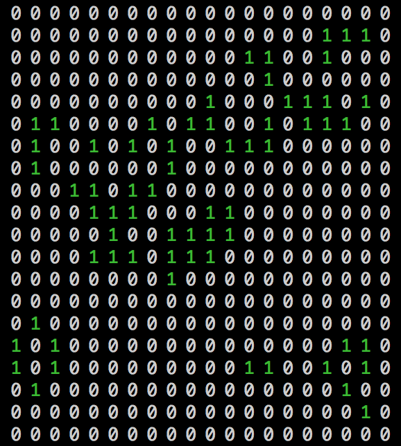

# GameOfGo - Conway's Game of Life implemented in Go

By Oscar Bennett

This project is a [Go](https://golang.org) implementation of Conway's Game of Life. This program simulates a world which produces interesting animations dependant on the initial conditions and world rules you choose. The program can print the evolving world state to screen:

<p align="center"></p>

Here 1s are 'alive' and 0s are 'dead'. A nice explanation of the ideas underlying the algorithm can be found [here](https://en.wikipedia.org/wiki/Conway%27s_Game_of_Life).

The program has various parameters which control how it runs (found in the main() function):
```go

iter_num := 10 // number of world iterations to run for
size := 30 // size of the world (eg this would produce a 30x30 square)
parallel_comp := false // Whether to run the parallel version of the Go code
print_world := true // Whether to print the evolving world to screen (size must be =< 50 to print)

```

Running the simulation is numerically intensive but the calculations involved are a good example of an [embarrassingly parallel](https://en.wikipedia.org/wiki/Embarrassingly_parallel) program. Go is a great language for running things concurrently. I've implemented a serial and parallel version of the program. The parallel version uses Goroutines to make the world updates happen in parallel across local cores. I find that I get a roughly x2 speed up with the parallel version when the world size > 100. See what you find!

NB: To time the program properly set `print_world := false` since the computation is intentionally slowed to make the world updates visible if `print_world := true`.

To run the code:
- Clone the repo and cd into directory
- Install [Go](https://golang.org/dl/)
- Run `go build gog.go`
- Run `./gog`

Various parts of the code should automatically time themselves. Please feel free to let me know about any suggestions or issues!
